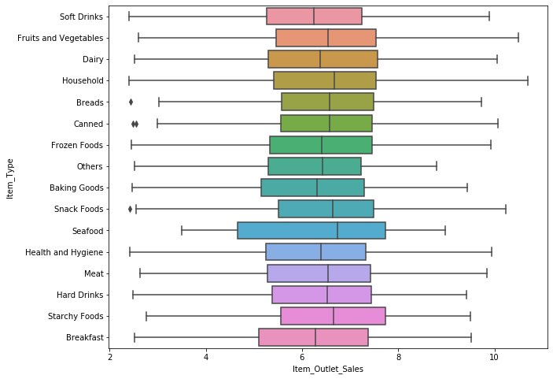

# store_sales_prediction
  

According to the quote, "Success in sales is the sum of small efforts, repeated day in & day out". 

Let us consider a supermarket has several outlets or stores around the world & they want us to predict the sales they can expect. We can tell the company what challenges they may face or what brands or products sold the most & other such kind of things. This helps the sales team to understand which product to sell & which product to promote & other such kind of things. They can also make several marketing plans(let's say that a particular product in the store is getting sold the most & we may find some insights from it - as to why this product is getting sold the most & this helps the company to make better marketing decisions).

---
### Problem Statement:
Nowadays, shopping malls and Big Marts keep track of individual item sales data to forecast future client demand and adjust inventory management. In a data warehouse, these data stores hold a significant amount of consumer information and particular item details. By mining the data stored in the data warehouse, more anomalies and common patterns can be discovered.
The main goal is to make the analysis of data and to build a Machine Learning model to predict the sales of each item at a particular outlet. We have 12 columns and 8523 rows of data. We get this data from [Kaggle](https://www.kaggle.com/datasets/brijbhushannanda1979/bigmart-sales-data). 

---
### Exploratory Data Analysis (EDA)
Let's make some hypotheses about the features of the data. Let's ask what element can increase or decrease item sales for a supermarket:

- The usefulness of the product for the vast majority of customers is defined by product category or the brand of the product, and so on. But, based on our dataset, we can use the "Item_Type" feature to estimate the kind of product that is loved by customers.
- The price of a product can influence sales. To validate this hypothesis, we will check the correlation between "Item_MRP" and "Item_Outlet_Sales."
- The visibility of a product in the store: Column "Item_Visibility"
- The place where the store is located: the product's price may be different, depending on the location of the store. So, "Outlet_Location_Type" is a piece of important information.

These hypotheses are subjective. But with further exploration of the data, we will accept or reject each of these assumptions.

---
### Data Visualization
- Data visualization is the graphical representation of information and data.
- It enables decision-makers to see analytics presented visually, so they can grasp difficult concepts or identify new patterns.
- Summary of the dataset:

- Present outliers in the data:

- Pairplot and Heatmap:

 

- Boxplots:

---
### Data Preprocessing:
As we saw, our dataset contains null values in two columns: Item_Weight and Outlet_Size. By making it exploratory we found some ideas about how we can deal with NaN values in these columns.
- All the Null values in **Item_Weight** belongs to the Year 1985. 
- We replaced null values of **Item_Weight** with each Item_Identifier's mean Weight.
- For the 'Outlet_Size' column, we found a relation between Outlet_Size and Outlet_Type. We will use this to impute Outlet_Size by taking the most frequent Size based on Outlet type.
- As the **Item_Visibility** and **Item_Outlet_sales** were right skewed. We applied *exponential transformation* to reduce skewness or outliers.

- We made the values of the column "Item_Fat_Content" uniform.
- Manage categorical columns with **LabelEncoder**.

---
<<<<<<< HEAD
### WebApp Link: https://store-sales-prediction-app.herokuapp.com/
=======
### WebApp Link : https://store-sales-prediction-app.herokuapp.com/

>>>>>>> 0286e366d600dbb3646562e502858e2adfa8f199
---
### Credit:
- Dipendra Singh https://www.linkedin.com/in/dipendrahada/
- Dinansh Bhardwaj https://www.linkedin.com/in/dinansh/
#### Thank You for reading 😃  If you like this project, please do give the star. If you have any suggestions or issues, please drop a message.
